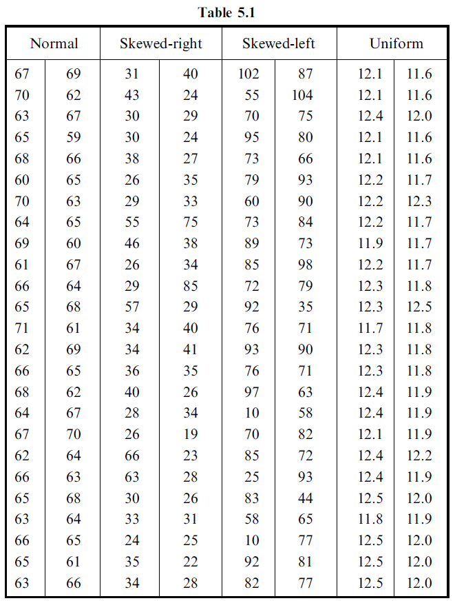

FA4
================
Leiana Mari D. Aquino
2023-10-04

**Details**

The data in Table 5.1 samples of size 50 from a normal distribution, a
skewed-right distribution, a skewed-left distribution, and a uniform
distribution.

The normal data are female height measurements, the skewed-right data
are age at marriage for females, the skewed-left data are obituary data
that give the age at death for females, and the uniform data are the
amount of cola put into a 12 ounce container by a soft drinks machine.



**Compute the following using R or Python.**

1.  Find the (a) first, (b) second, (c) third, and (d) fourth moments
    for each of the sets of data (normal, skewed-right, skewed-left,
    uniform).
2.  Find the (a) first, (b) second, (c) third, and (d) fourth moments
    about the mean for each of the sets of data (normal, skewed-right,
    skewed-left, uniform).
3.  Find the (a) first, (b) second, (c) third, and (d) fourth moments
    about the number 75 for the set of female height measurements.
4.  Using the results of items 2 and 3 for the set of female height
    measurements, verify the relations between the moments
    - 1)  $m_2 = m'_2 - m'^2_1$

    - 2)  $m_3 = m'_3 - 3m'_1m'_2 + 2m'^3_1$

    - 3)  $m_4 = m'_4 - 4m'_1m'_3 + 6m'^2_1m'_2 - 3m'^4_1$  

### Load packages and check data

``` r
# load the 'moments' package
library(moments)
library(e1071)
```

    ## 
    ## Attaching package: 'e1071'

    ## The following objects are masked from 'package:moments':
    ## 
    ##     kurtosis, moment, skewness

``` r
library(knitr) # data visualization
library(kableExtra)
```

    ## Warning: package 'kableExtra' was built under R version 4.2.3

Now that our packages are loaded, let’s read in and take a peek at the
data.

``` r
# read the csv file and create a dataframe
data <- read.csv('data.csv', stringsAsFactors = F)

# check the dataframe
str(data)
```

    ## 'data.frame':    50 obs. of  4 variables:
    ##  $ Normal      : int  67 70 63 65 68 60 70 64 69 61 ...
    ##  $ Skewed.right: int  31 43 30 30 38 26 29 55 46 26 ...
    ##  $ Skewed.left : int  102 55 70 95 73 79 60 73 89 85 ...
    ##  $ Uniform     : num  12.1 12.1 12.4 12.1 12.1 12.2 12.2 12.2 11.9 12.2 ...

``` r
# extract/grab the column containing the data of each set
normal_data <- data$Normal
skewed_right_data <- data$Skewed.right
skewed_left_data <- data$Skewed.left
uniform_data <- data$Uniform
```

## Moments

Find the (a) first, (b) second, (c) third, and (d) fourth moments for
each of the sets of data.

``` r
# calculate moments for the normal data
normal_first_moment <- round(mean(normal_data),2)
normal_second_moment <- round(sd(normal_data), 2)
normal_third_moment <- round(skewness(normal_data), 2)
normal_fourth_moment <- round(kurtosis(normal_data, type = 2), 2)

# calculate moments for the skewed right data
skewed_right_first_moment <- round(mean(skewed_right_data),2)
skewed_right_second_moment <- round(sd(skewed_right_data), 2)
skewed_right_third_moment <- round(skewness(skewed_right_data), 2)
skewed_right_fourth_moment <- round(kurtosis(skewed_right_data, type = 2), 2)

# calculate moments for the skewed left data
skewed_left_first_moment <- round(mean(skewed_left_data),2)
skewed_left_second_moment <- round(sd(skewed_left_data), 2)
skewed_left_third_moment <- round(skewness(skewed_left_data), 2)
skewed_left_fourth_moment <- round(kurtosis(skewed_left_data, type = 2), 2)

# calculate moments for the uniform data
uniform_first_moment <- round(mean(uniform_data),2)
uniform_second_moment <- round(sd(uniform_data), 2)
uniform_third_moment <- round(skewness(uniform_data), 2)
uniform_fourth_moment <- round(kurtosis(uniform_data, type = 2), 2)

# create a dataframe
moments_table <- data.frame(
  Distribution = c("Normal", "Skewed Right", "Skewed Left", "Uniform"),
  First_Moment = c(normal_first_moment, skewed_right_first_moment, skewed_left_first_moment, uniform_first_moment),
  Second_Moment = c(normal_second_moment, skewed_right_second_moment, skewed_left_second_moment, uniform_second_moment),
  Third_Moment = c(normal_third_moment, skewed_right_third_moment, skewed_left_third_moment, uniform_third_moment),
  Fourth_Moment = c(normal_fourth_moment, skewed_right_fourth_moment, skewed_left_fourth_moment, uniform_fourth_moment)
)

# print the moments table
kbl(moments_table) %>%
  kable_styling(bootstrap_options = "striped", full_width = F, position = "left")
```

<table class="table table-striped" style="width: auto !important; ">
<thead>
<tr>
<th style="text-align:left;">
Distribution
</th>
<th style="text-align:right;">
First_Moment
</th>
<th style="text-align:right;">
Second_Moment
</th>
<th style="text-align:right;">
Third_Moment
</th>
<th style="text-align:right;">
Fourth_Moment
</th>
</tr>
</thead>
<tbody>
<tr>
<td style="text-align:left;">
Normal
</td>
<td style="text-align:right;">
65.12
</td>
<td style="text-align:right;">
2.91
</td>
<td style="text-align:right;">
-0.02
</td>
<td style="text-align:right;">
-0.61
</td>
</tr>
<tr>
<td style="text-align:left;">
Skewed Right
</td>
<td style="text-align:right;">
35.48
</td>
<td style="text-align:right;">
13.51
</td>
<td style="text-align:right;">
1.86
</td>
<td style="text-align:right;">
4.10
</td>
</tr>
<tr>
<td style="text-align:left;">
Skewed Left
</td>
<td style="text-align:right;">
74.20
</td>
<td style="text-align:right;">
20.70
</td>
<td style="text-align:right;">
-1.41
</td>
<td style="text-align:right;">
2.64
</td>
</tr>
<tr>
<td style="text-align:left;">
Uniform
</td>
<td style="text-align:right;">
12.06
</td>
<td style="text-align:right;">
0.28
</td>
<td style="text-align:right;">
0.01
</td>
<td style="text-align:right;">
-1.19
</td>
</tr>
</tbody>
</table>

``` r
# extract/grab the column containing the data of each set
normal_mean <- mean(normal_data)
skewed_right_mean <- mean(skewed_right_data)
skewed_left_mean <- mean(skewed_left_data)
uniform_mean <- mean(uniform_data)
```

## Moments About The Mean

Find the (a) first, (b) second, (c) third, and (d) fourth moments about
the mean for for each of the sets of data.

``` r
# calculate moments about the mean for the normal data
normal_first_moment_mean <- mean(normal_data - normal_mean)
normal_second_moment_mean <- round(moment(normal_data - normal_mean, order = 2), 2)
normal_third_moment_mean <- round(moment(normal_data - normal_mean, order = 3), 2)
normal_fourth_moment_mean <- round(moment(normal_data - normal_mean, order = 4), 2)

# calculate moments about the mean for the skewed right data
skewed_right_first_moment_mean <- round(mean(skewed_right_data - skewed_right_mean),2)
skewed_right_second_moment_mean <- round(moment(skewed_right_data - skewed_right_mean, order = 2), 2)
skewed_right_third_moment_mean <- round(moment(skewed_right_data - skewed_right_mean, order = 3), 2)
skewed_right_fourth_moment_mean <- round(moment(skewed_right_data - skewed_right_mean, order = 4), 2)

# calculate moments about the mean for the skewed left data
skewed_left_first_moment_mean <- round(mean(skewed_left_data - skewed_left_mean),2)
skewed_left_second_moment_mean <- round(moment(skewed_left_data - skewed_left_mean, order = 2), 2)
skewed_left_third_moment_mean <- round(moment(skewed_left_data - skewed_left_mean, order = 3), 2)
skewed_left_fourth_moment_mean <- round(moment(skewed_left_data - skewed_left_mean, order = 4), 2)

# calculate moments about the mean for the uniform data
uniform_first_moment_mean <- round(mean(uniform_data - uniform_mean),2)
uniform_second_moment_mean <- round(moment(uniform_data - uniform_mean, order = 2), 2)
uniform_third_moment_mean <- round(moment(uniform_data - uniform_mean, order = 3), 2)
uniform_fourth_moment_mean <- round(moment(uniform_data - uniform_mean, order = 4), 2)

# create a dataframe
moments_mean_table <- data.frame(
  Distribution = c("Normal", "Skewed Right", "Skewed Left", "Uniform"),
  First_Moment = c(normal_first_moment_mean, skewed_right_first_moment_mean, skewed_left_first_moment_mean, uniform_first_moment_mean),
  Second_Moment = c(normal_second_moment_mean, skewed_right_second_moment_mean, skewed_left_second_moment_mean, uniform_second_moment_mean),
  Third_Moment = c(normal_third_moment_mean, skewed_right_third_moment_mean, skewed_left_third_moment_mean, uniform_third_moment_mean),
  Fourth_Moment = c(normal_fourth_moment_mean, skewed_right_fourth_moment_mean, skewed_left_fourth_moment_mean, uniform_fourth_moment_mean)
)

# print the moments table
kbl(moments_mean_table) %>%
  kable_styling(bootstrap_options = "striped", full_width = F, position = "left")
```

<table class="table table-striped" style="width: auto !important; ">
<thead>
<tr>
<th style="text-align:left;">
Distribution
</th>
<th style="text-align:right;">
First_Moment
</th>
<th style="text-align:right;">
Second_Moment
</th>
<th style="text-align:right;">
Third_Moment
</th>
<th style="text-align:right;">
Fourth_Moment
</th>
</tr>
</thead>
<tbody>
<tr>
<td style="text-align:left;">
Normal
</td>
<td style="text-align:right;">
0
</td>
<td style="text-align:right;">
8.31
</td>
<td style="text-align:right;">
-0.47
</td>
<td style="text-align:right;">
160.95
</td>
</tr>
<tr>
<td style="text-align:left;">
Skewed Right
</td>
<td style="text-align:right;">
0
</td>
<td style="text-align:right;">
178.89
</td>
<td style="text-align:right;">
4588.13
</td>
<td style="text-align:right;">
210642.88
</td>
</tr>
<tr>
<td style="text-align:left;">
Skewed Left
</td>
<td style="text-align:right;">
0
</td>
<td style="text-align:right;">
419.76
</td>
<td style="text-align:right;">
-12498.26
</td>
<td style="text-align:right;">
927289.75
</td>
</tr>
<tr>
<td style="text-align:left;">
Uniform
</td>
<td style="text-align:right;">
0
</td>
<td style="text-align:right;">
0.08
</td>
<td style="text-align:right;">
0.00
</td>
<td style="text-align:right;">
0.01
</td>
</tr>
</tbody>
</table>

## Moment About The Number 75: Normal data (Female height measurements)

``` r
# set the number to calculate moments about
number <- 75
```

Find the (a) first, (b) second, (c) third, and (d) fourth moments about
the number 75 for the set of female height measurements.

``` r
# calculate the moments about the number
normal_first_moment_num <- round(moment(normal_data - number, order = 1), 2)
normal_second_moment_num <- round(moment(normal_data - number, order = 2), 2)
normal_third_moment_num <- round(moment(normal_data - number, order = 3), 2)
normal_fourth_moment_num <- round(moment(normal_data - number, order = 4), 2)

# create a dataframe
heights_table <- data.frame(
  Normal = c("Female Height"),
  First_Moment = c(normal_first_moment_num),
  Second_Moment = c(normal_second_moment_num),
  Third_Moment = c(normal_third_moment_num),
  Fourth_Moment = c(normal_fourth_moment_num)
)

# print the moments table
kbl(heights_table) %>%
  kable_styling(bootstrap_options = "striped", full_width = F, position = "left")
```

<table class="table table-striped" style="width: auto !important; ">
<thead>
<tr>
<th style="text-align:left;">
Normal
</th>
<th style="text-align:right;">
First_Moment
</th>
<th style="text-align:right;">
Second_Moment
</th>
<th style="text-align:right;">
Third_Moment
</th>
<th style="text-align:right;">
Fourth_Moment
</th>
</tr>
</thead>
<tbody>
<tr>
<td style="text-align:left;">
Female Height
</td>
<td style="text-align:right;">
-9.88
</td>
<td style="text-align:right;">
105.92
</td>
<td style="text-align:right;">
-1211.08
</td>
<td style="text-align:right;">
14572.64
</td>
</tr>
</tbody>
</table>

## Verify the relations between the moments

Using the results of items 2 and 3 for the set of female height
measurements (normal distribution), verify the relations between the
moments.

``` r
# result of item 2
normal_first_moment_mean <- mean(normal_data - normal_mean)
normal_second_moment_mean <- round(moment(normal_data - normal_mean, order = 2), 2)
normal_third_moment_mean <- round(moment(normal_data - normal_mean, order = 3), 2)
normal_fourth_moment_mean <- round(moment(normal_data - normal_mean, order = 4), 2)

# result of item 3
normal_first_moment_num <- round(moment(normal_data - number, order = 1), 2)
normal_second_moment_num <- round(moment(normal_data - number, order = 2), 2)
normal_third_moment_num <- round(moment(normal_data - number, order = 3), 2)
normal_fourth_moment_num <- round(moment(normal_data - number, order = 4), 2)
```

### (a) $m_2 = m'_2 - m'^2_1$

``` r
# calculate the left-hand side (LHS) and right-hand side (RHS) of the equation
LHS_a <- normal_second_moment_mean
RHS_a <- normal_second_moment_num - normal_first_moment_num^2

# compare the LHS and RHS
relation_a <- LHS_a == RHS_a
print(relation_a)
```

    ## [1] FALSE

### (b) $m_3 = m'_3 - 3m'_1m'_2 + 2m'^3_1$

``` r
# Calculate the left-hand side (LHS) and right-hand side (RHS) of the equation
LHS_b <- normal_third_moment_mean
RHS_b <- normal_third_moment_num - 3 * normal_first_moment_num * normal_second_moment_num + 2 * normal_first_moment_num^3

# Compare the LHS and RHS
relation_b <- LHS_b == RHS_b
print(relation_b)
```

    ## [1] FALSE

### (c) $m_4 = m'_4 - 4m'_1m'_3 + 6m'^2_1m'_2 - 3m'^4_1$

``` r
# Calculate the left-hand side (LHS) and right-hand side (RHS) of the equation
LHS_c <- normal_fourth_moment_mean
RHS_c <- normal_fourth_moment_num - 4 * normal_first_moment_num * normal_third_moment_num + 6 * normal_first_moment_num^2 * normal_second_moment_num - 3 * normal_first_moment_num^4

# Compare the LHS and RHS
relation_c <- LHS_c == RHS_c
print(relation_c)
```

    ## [1] FALSE
